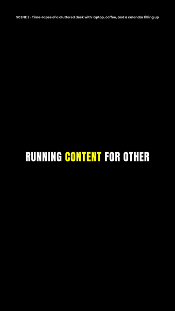

# script2video

Paste a script. Pick one of two caption styles. Press Generate. You get back
one MP4 with a voiceover and the captions burned into the picture, plus a list
of where the b-roll should go.

Built as a test task. It is deliberately small: one server file, one HTML page,
no build step, no database, no accounts.

 

## Run it

```bash
npm install
npm run doctor    # says whether this machine can run it
npm start         # http://localhost:3000
```

`npm run doctor` is the first thing to run on a new machine. It checks that
ffmpeg can burn subtitles, that a voice is installed, and that the fonts are
where the renderer expects them.

Optional, in a `.env` file (copy `.env.example`):

| Variable | What it does |
|---|---|
| `ANTHROPIC_API_KEY` | Claude writes the scene suggestions. Without it a built-in heuristic does, and the page says which one ran. |
| `FFMPEG_PATH`, `FFPROBE_PATH` | Point at your own ffmpeg. The bundled `ffmpeg-static` binary is used otherwise. |
| `TTS_VOICE`, `TTS_RATE` | Pick a different system voice or speed. |
| `PORT` | Defaults to 3000. |

## What happens when you press Generate

```
script
  |
  +-- split into sentences ................ lib/chunk.js
  |
  +-- speak each sentence, measure it ..... lib/tts/*, lib/audio.js  --+
  |     (macOS "say" or Windows System.Speech)                        |  in parallel
  +-- plan the scenes ..................... lib/scenes.js  -----------+
  |     (Claude, or a heuristic if there is no key)
  |
  +-- write one subtitle file ............. lib/ass.js
  |     captions in the chosen style + scene labels on their own layer
  |
  +-- one ffmpeg call ..................... lib/render.js
        black 1080x1920 canvas + voice track + libass burn-in
  |
  video.mp4
```

The page polls the job and prints every stage as it happens, including the
actual `say` and `ffmpeg` commands. That panel is the tool explaining itself.

### Timing

The operating-system voices hand back audio and nothing else, so word timings
are worked out rather than measured. Each sentence gets its real length from
ffprobe. Inside a sentence, words are given time in proportion to how long they
take to say: letter count, plus a beat for punctuation. It lands close enough
that captions track the voice.

That guesswork lives in one place (`lib/timing.js`) behind one seam. An engine
that returns real word timestamps fills in `words` and the estimate is skipped.
`lib/tts/elevenlabs.js` sketches that path. It is untested here because the
demo ran on the built-in voices.

### The two styles

**Classic.** White Poppins in a soft dark bar along the bottom, whole phrases
at a time, wrapped onto two balanced lines. Reads like a documentary caption.

**Pop.** Anton capitals in the middle of the frame, three or four words at a
time, and the word being spoken turns yellow. The highlight is done with one
subtitle event per word instead of karaoke tags, so only the colour changes and
the centred line never shifts on screen.

### Scene suggestions

They show up in three places: a numbered list beside the video, a label along
the top of the video itself while that scene plays, and `scenes.json` next to
the MP4. Claude proposes them when a key is set. Otherwise sentences are
grouped in pairs and the shot is named after the strongest phrase in the first
one. Either way the result is clamped before use: indices in range, every
sentence covered once, no braces that could break the subtitle format.

## Windows notes

Everything here runs on Windows without changes. Three things to know:

1. **ffmpeg.** `npm install` downloads a binary through `ffmpeg-static`. Newer
   npm blocks install scripts by default, so if `npm run doctor` cannot find
   ffmpeg, run `node node_modules/ffmpeg-static/install.js`, or set
   `FFMPEG_PATH` to any full build (the gyan.dev builds include libass).
2. **The voice** comes from `System.Speech`, which is part of Windows. The
   script that drives it runs with `-ExecutionPolicy Bypass`, so the machine's
   policy does not need changing. `npm run doctor` lists the installed voices;
   put one in `TTS_VOICE` to switch.
3. **Fonts** are bundled in `assets/fonts` and handed to ffmpeg directly, so
   nothing has to be installed system-wide.

## Tests

```bash
npm test     # sentence splitting, timing, subtitle building, scene handling
npm run smoke  # renders both styles and checks the MP4 with ffprobe
```

`npm test` needs neither ffmpeg nor a voice, because the parts worth testing
are pure functions. The smoke test does the opposite: it renders for real and
asserts the output is one file with one video stream, one audio stream, the
right dimensions, and a duration that matches the voice track.

## Licence

MIT, except the bundled fonts (Anton and Poppins), which are under the SIL Open
Font License. See `assets/fonts`.
